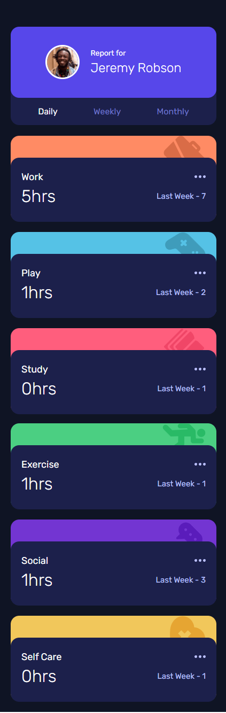
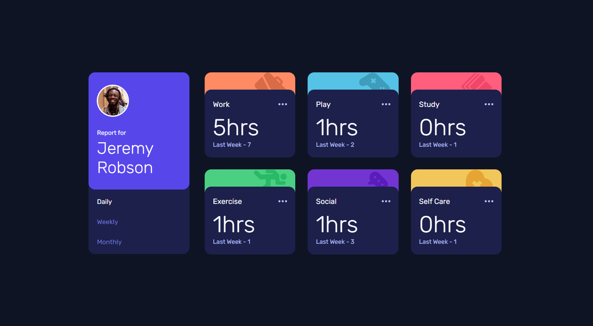

# Frontend Mentor - Time Tracking Dashboard solution

This is a solution to the [Time tracking dashboard challenge on Frontend Mentor](https://www.frontendmentor.io/challenges/time-tracking-dashboard-UIQ7167Jw/hub).

### Screenshot

**Mobile version of the final product**

**Desktop version of the final product**

## My process

### Built with

-   Figma file designs
-   Semantic HTML5 markup
-   SCSS custom properties
-   Flexbox
-   Mobile-first workflow
-   BEM Methodology

## Author

-   Website - [GitHub](https://github.com/joshhovis)
-   LinkedIn - [LinkedIn](https://www.linkedin.com/in/joshua-hovis/)
-   Frontend Mentor - [@joshhovis](https://www.frontendmentor.io/profile/joshhovis)
